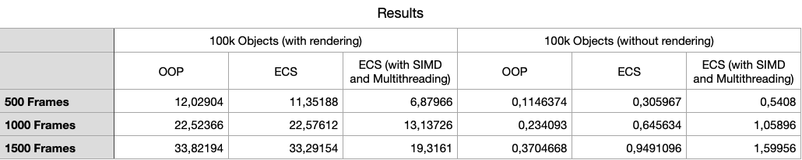
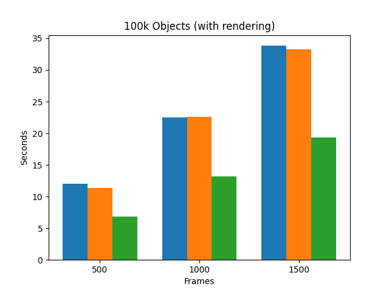
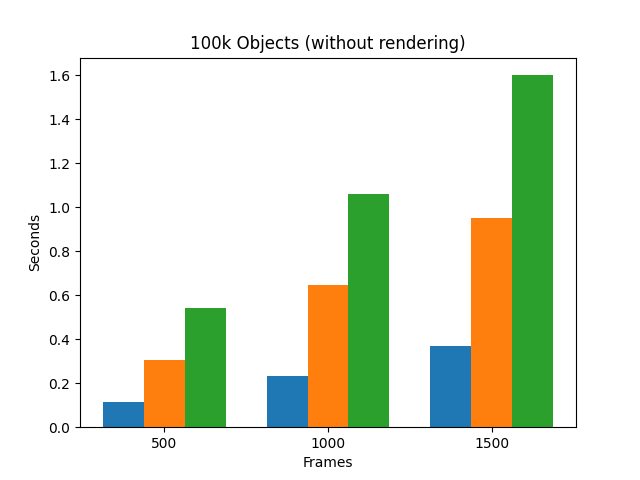

# Benchmark environment

## Test setup:
- Machine: MacBook Pro M3
- CPU: Apple M3
- Memory: 8 Gb
- Compiler: clang
- Flags: -O3

## Simulation parameters:
- gravity
- air resistance
- elastic wall collision

## Benchmark configuration:
Objects: 100,000
Frames: 500, 1000, 1500
Runs per test: 5
Mode:
- With rendering
- Without rendering

## Notes:
- Each frame updates all objects independently.
- The workload per frame is relatively small, which affects multithreading efficiency.
- Rendering uses SDL_RenderDrawPoints.

## Measurement method:
Execution time measured using std::chrono::high_resolution_clock.
Each test was repeated 5 times and averaged.

## Results Visualization:

The following figure shows execution time across different configurations:

### With Rendering

### Without Rendering

## Observations:
- Execution time scales approximately linearly with frame count.
- Rendering significantly increases total runtime.
- ECS optimized performs best only when rendering is enabled.
- Without rendering, OOP consistently outperforms ECS variants.
